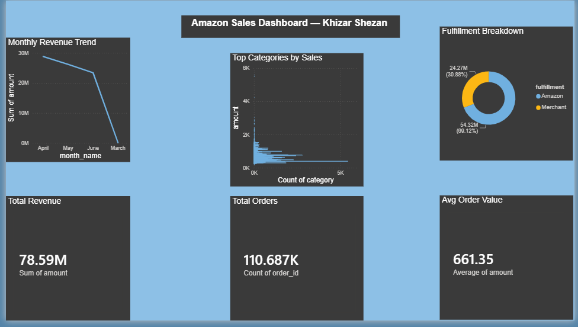

# Amazon E-Commerce Sales Dashboard

## Overview
An end-to-end data analytics project analyzing 118,000+ real Amazon sales records using Python, MySQL, and Power BI.

## Key Insights
- Total Revenue: ₹78.59M
- Total Orders: 110,687
- Average Order Value: ₹661.35
- Amazon fulfills 69% of orders vs 31% Merchant

## Tech Stack
- **Python** — Data cleaning and processing
- **Pandas** — Data manipulation
- **MySQL** — Data storage and querying
- **Power BI** — Interactive dashboard

## Project Structure
- `data/` — Dataset files
- `scripts/clean_data.py` — Data cleaning script
- `scripts/load_to_mysql.py` — MySQL loading script
- `amazon_sales_dashboard.pbix` — Power BI dashboard

## How to Run
1. Run `clean_data.py` to clean the dataset
2. Run `load_to_mysql.py` to load data into MySQL
3. Open `amazon_sales_dashboard.pbix` in Power BI Desktop
